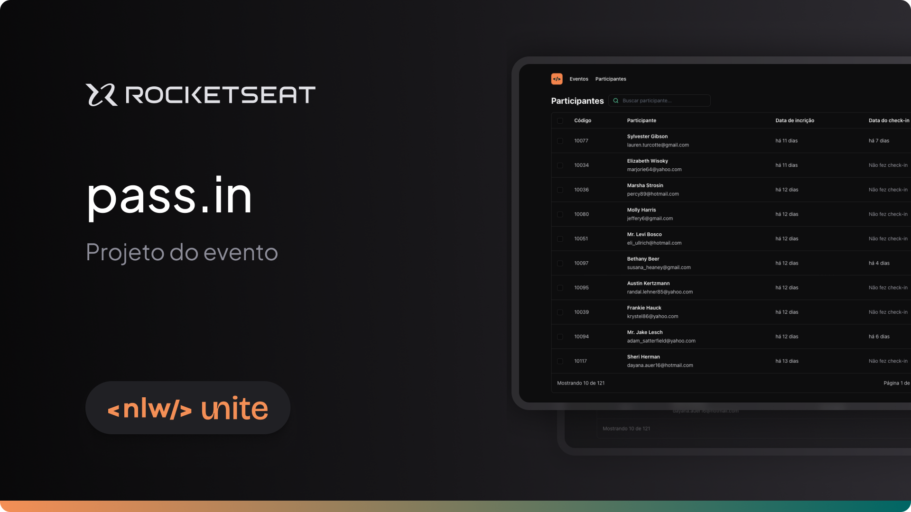

# pass.in

Project developed on Rocketseat's NLW Unite

**pass.in is a participant management application for in-person events, designed to learn ReactJS concepts**



## 📋 Project information

- NWL Unite React

## 🧠 Concepts learned

The development of this project aims to learn the following concepts:

- URL State
- Manipulating date strings with the dayjs library
- Style with TailwindCSS
- Connecting to an API

## Getting Started

- ### Back-end
  - Clone the api project:
    ```bash
    git clone https://github.com/emanueltavecia/pass-in-api.git
    ```
  - Access project folder:
    ```bash
    cd pass-in-api
    ```
  - Create a `.env` file with the following environment variable:
    ```
    DATABASE_URL='file:./dev.db'
    ```
  - Install dependencies:
    ```bash
    npm install
    ```
  - Run project:
    ```bash
    npm run dev
    ```

- ### Front-end
  - Clone the web project:
    ```bash
    git clone https://github.com/emanueltavecia/pass-in-web.git
    ```
  - Access project folder:
    ```bash
    cd pass-in-web
    ```
  - Install dependencies:
    ```bash
    npm install
    ```
  - Run project:
    ```bash
    npm run dev
    ```

- 🎉 Finished, now you can access "http://localhost:5173/" on your browser and test the application.

## 🔗 Project Links

- 🚀 [**Deploy without back-end**](https://passin-app.vercel.app/)
- 🎨 [**Figma**](https://www.figma.com/community/file/1356738933008624188)

## 💻 Technologies


## 📄 License

This project is licensed under the MIT License - see the [LICENSE](./LICENSE) file for more details.
